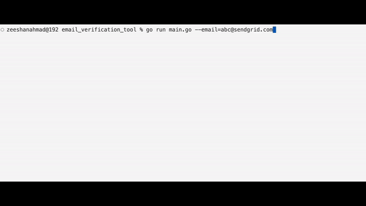

# Email Verification Tool



## Introduction

The Email Verification Tool is a lightweight and efficient GoLang-based utility designed to validate email addresses. It checks for basic syntax correctness, domain validity, and DNS records to ensure that the provided email address is likely to be valid. This tool does not include SMTP verification.

## Features

- **Syntax Validation**: Ensures the email address adheres to standard email formatting rules.
- **Domain Check**: Verifies if the domain part of the email address has valid MX (Mail Exchange) records.
- **DNS Record Check**: Checks for the presence of TXT records, SPF, and DMARC records for domain verification.

## Installation

To get started with the Email Verification Tool, you need to have Go installed on your system. Follow these steps to install and set up the tool:

1. **Clone the Repository**:

    ```bash
    git clone https://github.com/zeeshanahmad0201/email_verification_tool.git
    ```

2. **Navigate to the Project Directory**:

    ```bash
    cd email_verification_tool
    ```

3. **Install Dependencies**:

    ```bash
    go mod tidy
    ```

4. **Build the Tool**:

    ```bash
    go build -o email_verification_tool
    ```

## Usage

You can use the Email Verification Tool directly from the command line. Here’s how to use it:

1. **Run the Tool**:

    ```bash
    ./ev --email=<email-address>
    ```

2. **Example**:

    ```bash
    ./ev --email=test@example.com
    ```

   The tool will output whether the email address is likely valid or not based on the checks performed.

## Contributing

We welcome contributions to enhance the Email Verification Tool. If you have any improvements, bug fixes, or new features, please follow these steps to contribute:

1. **Fork the Repository**: Create your own fork of the project.
2. **Create a Branch**: Create a new branch for your changes.

    ```bash
    git checkout -b feature-branch
    ```

3. **Make Your Changes**: Implement your improvements or fixes.
4. **Commit Your Changes**:

    ```bash
    git add .
    git commit -m "Describe your changes"
    ```

5. **Push to Your Fork**:

    ```bash
    git push origin feature-branch
    ```

6. **Create a Pull Request**: Open a pull request from your fork to the main repository.

## License

This project is licensed under the MIT License. See the [LICENSE](LICENSE) file for details.

## Contact

For any questions or inquiries, please reach out to:

- **Name**: Zeeshan Ahmad
- **Email**: [xeeshanahmad0201@gmail.com](mailto:xeeshanahmad0201@gmail.com)
- **GitHub**: [github.com/zeeshanahmad0201](https://github.com/zeeshanahmad0201)